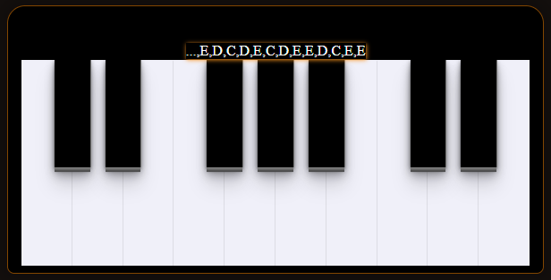

<h1 align=center>

</h1>

<h3 align="center">

Piano-Web é um projeto desenvolvido através de um **video de MasterClass** da **Rocketseat** utilizando exclusivamente ***JavaScript*** com o objetivo de estudar a manipulação da árvore de objetos de uma página HTML, comumente conhecido como **DOM** (Document Object Model).

</h3>

## **:rocket: OBJETIVO**

O projeto tem como finalidade **estudar métodos que permitem acesso à árvore, para que eles possam alterar a estrutura, estilo e conteúdo do documento** diretamente no Front-end através do **JavaScript**.

## **:computer: Utilitários**

- **Veja funcionando: &rarr; <kbd>[Piano Web](https://piano-web.netlify.app/)</kbd>**

## **:gem: Um "algo mais"**

## **AGRADECIMENTOS**

<table style="width:100%">
  <tr align=center>
    <th><strong>
Rocketseat
</strong></th>
    <th><strong>
Maykbrito
</strong></th>
  </tr>
  <tr align=center>
    <td>
      
    </td>
    <td>
      
    </td>
  </tr>
</table>

## **:books: REFERÊNCIAS**

- [Youtube RocketSeat](https://www.youtube.com/watch?v=UftSB4DaRU4)
